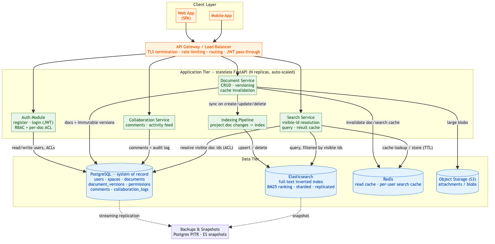
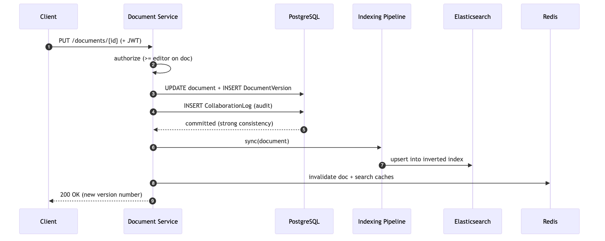
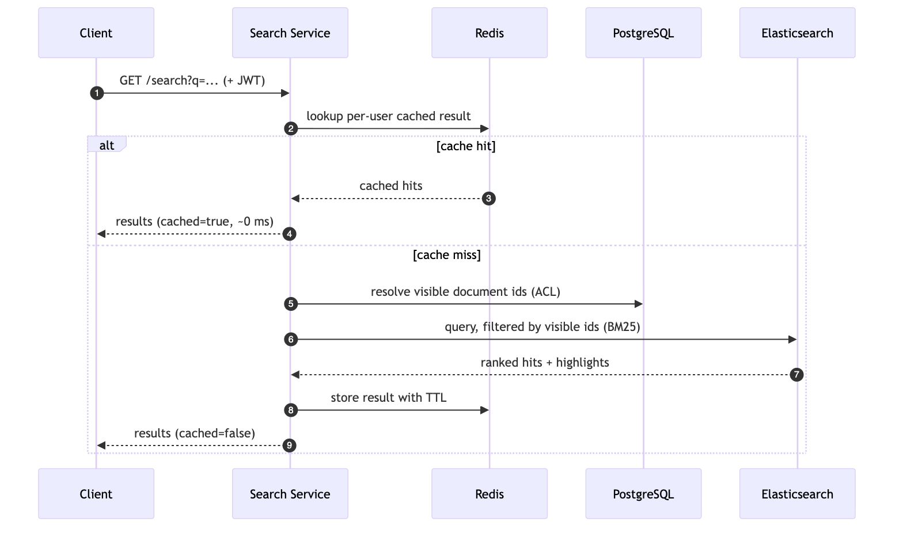
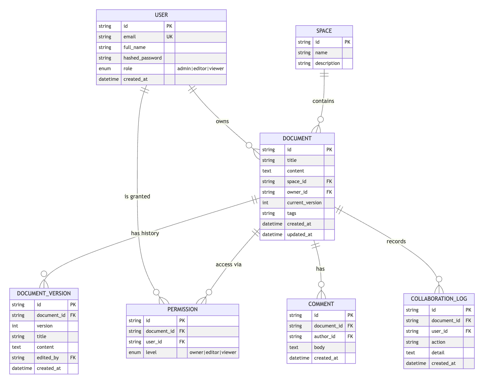
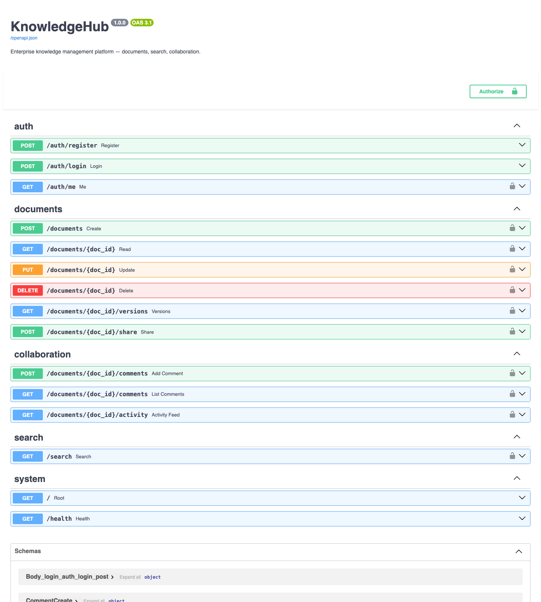
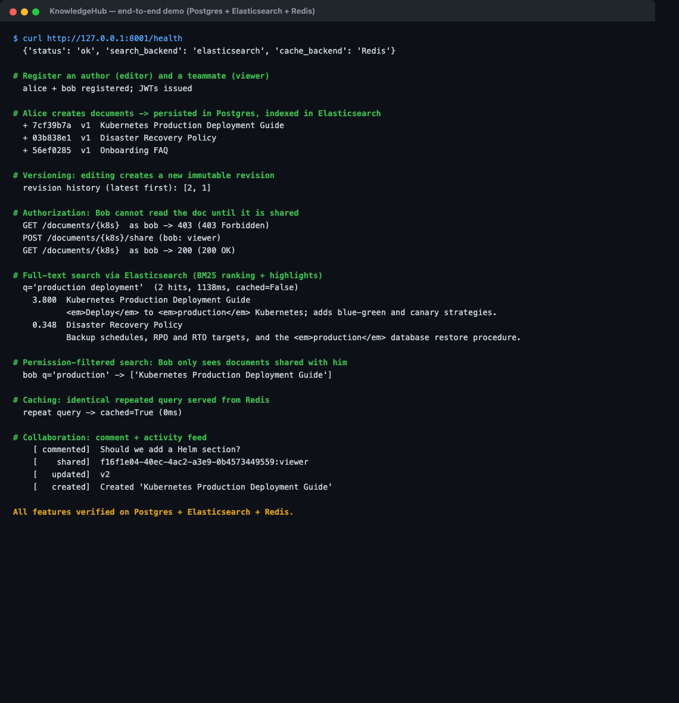

# KnowledgeHub — Project Documentation

**Designing a Scalable Knowledge Base System**
System Design • Semester 4

> Export this file (together with `docs/architecture.md`) to a single PDF for submission — see the command at the end.

---

## Table of Contents

1. Problem Statement
2. Proposed Solution
3. Requirements Analysis (Q1)
4. System Architecture (Q2)
5. Document Management & Search Workflow (Q3)
6. Database Design (Q4)
7. Indexing & Search Algorithm (Q5)
8. Scalability & Fault Tolerance (Q6)
9. Module Description
10. Technology Stack
11. Implementation Details
12. Screenshots
13. Comparison with Real-World Systems
14. Future Scope

---

## 1. Problem Statement

KnowledgeHub is an enterprise knowledge management platform — comparable to Confluence and Notion — that enables organizations to create, organize, search, and share technical documents, policies, FAQs, project documentation, and internal resources across teams. Employees use web and mobile clients to collaborate on documents, retrieve information quickly, and maintain organizational knowledge.

The platform must support **millions of documents and concurrent users** while delivering **fast search**, **collaboration features**, and **secure access control**. The core engineering challenges are:

- distributed document storage,
- maintaining version consistency,
- full-text indexing at scale,
- managing fine-grained user permissions, and
- enabling scalable collaboration workflows,

all while guaranteeing **high availability, fault tolerance, efficient synchronization, and reliable backups**.

---

## 2. Proposed Solution

We propose a **service-oriented, horizontally scalable architecture** with a clear separation between the **system of record** and **derived read models**:

- A **stateless FastAPI application tier** exposes authentication, document, search, and collaboration APIs and can be replicated behind a load balancer.
- **PostgreSQL** is the single source of truth for documents, immutable version history, permissions (ACLs), comments, and audit logs.
- **Elasticsearch** maintains a full-text inverted index for sub-second search; it is a *derived* store that can be rebuilt from PostgreSQL.
- **Redis** caches hot document reads and permission-scoped search results to absorb read traffic.
- An **indexing pipeline** keeps the search index synchronized whenever documents change.
- **Object storage (S3-compatible)** holds large attachments/blobs (design-level; the reference implementation stores text in Postgres).

A defining trait of the implementation is **graceful degradation**: each external dependency (Elasticsearch, Redis, Postgres) has a built-in fallback (a pure-Python inverted index, an in-memory cache, and SQLite respectively), so the system remains functional and demonstrable even when infrastructure is unavailable.

---

## 3. Requirements Analysis (Q1)

### 3.1 Functional Requirements

| # | Requirement |
|---|---|
| F1 | Users can register, authenticate, and receive a session token. |
| F2 | Users can create, read, update, and delete documents, organised into spaces and tagged. |
| F3 | Every document edit is preserved as an immutable version (revision history, diff/restore capable). |
| F4 | Users can perform full-text keyword search and receive ranked, highlighted results. |
| F5 | Owners can share documents and grant per-document access levels (owner/editor/viewer). |
| F6 | Users can collaborate via comments and view a per-document activity/audit feed. |
| F7 | Search results respect permissions — users only see documents they are allowed to access. |

### 3.2 Non-Functional Requirements

| # | Requirement | Target |
|---|---|---|
| N1 | **Search latency** | p95 < 200 ms for typical queries |
| N2 | **Scalability** | Millions of documents; tens of thousands of concurrent users |
| N3 | **Availability** | 99.9%+ via stateless tier + replicated data stores |
| N4 | **Consistency** | Strong consistency for document content/versions; eventual for the search index |
| N5 | **Security** | Encrypted transport, hashed passwords (bcrypt), JWT, RBAC + per-doc ACL |
| N6 | **Durability** | No data loss on node failure; point-in-time backups |
| N7 | **Maintainability** | Modular services, clear API contract, automated tests |

### 3.3 Why search efficiency, collaboration, and scalability matter

- **Search efficiency** is the product. A knowledge base that can't surface the right document in milliseconds is functionally useless; employees abandon it and knowledge silos re-form. An **inverted index** turns an O(N·document-size) scan into an O(query-terms) lookup, which is the only way to stay fast as the corpus grows to millions of documents.
- **Collaboration support** is what keeps knowledge *fresh*. Versioning, comments, and activity feeds let many people safely co-own a document, review changes, and trust that what they read is current — the difference between a living wiki and a graveyard of stale pages.
- **Scalability** is non-negotiable at enterprise size. Read and write volume, index size, and concurrent editing all grow with the organization. A **stateless application tier** (scale by adding replicas) plus **independently scalable data stores** (Postgres read replicas, Elasticsearch shards, Redis) lets each dimension scale on its own curve without rearchitecting.

---

## 4. System Architecture (Q2)

The platform is layered into **clients → gateway → stateless API services → data tier**. The editable Mermaid sources for every diagram below live in [`docs/diagrams/`](docs/diagrams/) and [`docs/architecture.md`](docs/architecture.md).

**Detailed system architecture**



*Figure 1 — Components, modules, and their interactions. The application tier is stateless and horizontally scaled; PostgreSQL is the system of record while Elasticsearch and Redis are independently scalable derived stores.*

**Write path (create / update a document)**



*Figure 2 — A document edit is committed to PostgreSQL (row + immutable version + audit log), then projected into the Elasticsearch index, and the affected caches are invalidated.*

**Search path (query)**



*Figure 3 — Search first consults the per-user Redis cache; on a miss it resolves the caller's visible document IDs from the ACL, queries Elasticsearch filtered to those IDs, then caches the result.*

**Component responsibilities**

- **API Gateway / Load Balancer** — TLS termination, rate limiting, routing, and fan-out across stateless API replicas.
- **Auth Service** — registration, login (JWT), and authorization (global RBAC + per-document ACL resolution).
- **Document Service** — CRUD, versioning, and orchestration of index sync + cache invalidation.
- **Search Service** — resolves the caller's visible document set, queries the index, caches results.
- **Collaboration Service** — comments and the append-only activity feed.
- **Indexing Pipeline** — projects document changes into the search index (synchronous in the reference build; queue-based in production).
- **PostgreSQL / Elasticsearch / Redis / Object Storage** — the data tier described above.

---

## 5. Document Management & Search Workflow (Q3)

### 5.1 Creation & versioning
1. An authenticated user `POST`s a document. The Document Service writes the `documents` row **and** a `document_versions` row (version 1) in one transaction.
2. On every update, the service compares fields, increments `current_version`, and appends a **new immutable version row** — history is never overwritten. This makes diffs, audits, and rollbacks trivial.

### 5.2 Indexing
3. After a successful commit, the **indexing pipeline** upserts `{title, content, tags, owner, space}` into Elasticsearch. The relational store stays authoritative; the index is a rebuildable projection.

### 5.3 Search
4. A query first checks **Redis** using a **per-user cache key** (so permission-filtered results never leak between users).
5. On a miss, the Search Service resolves the caller's **visible document IDs** from the ACL, queries Elasticsearch **filtered to those IDs**, and ranks results (TF-IDF/BM25) with highlights.
6. The result is cached with a TTL and returned. Document edits **invalidate** the relevant cache entries.

### 5.4 Synchronization & sharing
7. Sharing writes a `permissions` (ACL) row; authorization is enforced **at the data layer**, not just the UI, so search and direct reads both honour it.
8. Every action (`created/updated/shared/commented/deleted`) appends to `collaboration_logs`, powering activity feeds and providing an audit trail for synchronization across distributed teams.

**Security across distributed teams** is enforced by: TLS in transit, bcrypt-hashed credentials, short-lived JWTs, global roles plus per-document ACLs, and permission-filtered search.

---

## 6. Database Design (Q4)

We use a **relational schema (PostgreSQL)** as the system of record because documents, versions, permissions, and logs are highly relational and benefit from ACID guarantees and foreign-key integrity. Full-text data is offloaded to **Elasticsearch** (a NoSQL document/search store) where inverted-index search excels — a deliberate **polyglot-persistence** split: SQL for truth + relationships, NoSQL for search.

### 6.1 Entity-Relationship overview



*Figure 4 — Relational schema (PostgreSQL). `document_versions` is append-only for full revision history; `permissions` is the per-document ACL; `collaboration_logs` is the append-only audit trail.*

### 6.2 Tables & rationale

| Table | Purpose | Key design notes |
|---|---|---|
| `users` | Accounts & global role | Unique index on `email`; bcrypt hash stored, never the password. |
| `spaces` | Team workspaces | Groups related documents for navigation and bulk permissions. |
| `documents` | Current document state | Indexes on `title`, `owner_id`, `space_id`; `current_version` pointer; denormalised `tags` for fast filtering. |
| `document_versions` | Immutable revision history | `UNIQUE(document_id, version)`; append-only — enables diff/restore/audit. |
| `permissions` | Per-document ACL | `UNIQUE(document_id, user_id)`; level ∈ {owner, editor, viewer}. |
| `comments` | Collaboration threads | Indexed by `document_id`. |
| `collaboration_logs` | Append-only audit/activity | Indexed by `document_id` and `created_at` for fast feeds. |

### 6.3 Elasticsearch document mapping (search store)

```json
{
  "title":   {"type": "text", "analyzer": "english", "fields": {"raw": {"type": "keyword"}}},
  "content": {"type": "text", "analyzer": "english"},
  "tags":    {"type": "keyword"},
  "space_id":{"type": "keyword"},
  "owner_id":{"type": "keyword"},
  "updated_at": {"type": "date"}
}
```

Sharding/replication of this index is what lets search scale horizontally and stay highly available.

---

## 7. Indexing & Search Algorithm (Q5)

The reference algorithm lives in `app/services/inverted_index.py` (standard library only) and is demonstrated in `notebooks/demo.ipynb`.

### 7.1 Pipeline
1. **Analysis** — lower-case, tokenize on word boundaries, remove stop-words. The *same* analyzer is applied to documents and queries so terms match consistently.
2. **Indexing** — build a postings map `term -> {doc_id: term_frequency}` and track each document's length.
3. **Weighting** — at query time compute `idf(t) = ln(1 + N / df(t))` and TF-IDF weights per (doc, term).
4. **Ranking** — score documents by **cosine similarity** between the query and document TF-IDF vectors, normalising by vector magnitude so long documents aren't unfairly favoured.

### 7.2 Core logic (excerpt)

```python
def search(self, query, limit=10):
    q_tokens = tokenize(query)
    q_tf = Counter(q_tokens)
    q_vec = {t: tf * self._idf(t) for t, tf in q_tf.items()}
    q_norm = sqrt(sum(w*w for w in q_vec.values())) or 1.0

    scores = defaultdict(float)
    for term, q_weight in q_vec.items():
        idf = self._idf(term)
        for doc_id, tf in self.postings.get(term, {}).items():
            d_weight = (tf / self.doc_length[doc_id]) * idf   # TF normalised by length
            scores[doc_id] += q_weight * d_weight

    ranked = [(d, dot / (q_norm * self._doc_norm(d)), self._snippet(d, q_tokens))
              for d, dot in scores.items()]
    ranked.sort(key=lambda x: x[1], reverse=True)
    return ranked[:limit]
```

### 7.3 Why this design
- **Inverted index** → search touches only documents that contain a query term, not the whole corpus → scales to millions of documents.
- **IDF** down-weights ubiquitous words and rewards rare, discriminating terms.
- **Cosine similarity** gives a length-fair relevance score in [0, 1].
- These are exactly the principles behind Lucene/Elasticsearch (which use the closely related **BM25**); the reference code makes the mechanics explicit and serves as the offline fallback engine.

### 7.4 Worked example (from the notebook)

```
Query: 'production deployment'
  0.4749  Kubernetes Production Deployment Guide   Kubernetes deployment guide for production clusters
  0.4749  Deploy Checklist                         Production deployment checklist and rollback procedure
```

---

## 8. Scalability & Fault Tolerance (Q6)

### 8.1 Scaling to millions of documents & users

| Dimension | Strategy |
|---|---|
| **Application tier** | Stateless API → add replicas behind the load balancer; no sticky sessions (JWT). |
| **Search** | Elasticsearch **sharding** distributes the index across nodes; **replicas** add read throughput and HA. |
| **Database reads** | PostgreSQL **read replicas** serve heavy read traffic; primary handles writes. |
| **Database writes / data size** | **Partition/shard** large tables (e.g. by space or tenant); archive cold versions. |
| **Caching** | Redis absorbs repeated reads and search queries, cutting load on Postgres/ES. |
| **Async indexing** | A message queue (e.g. Kafka/RabbitMQ) decouples writes from indexing so write latency is unaffected by index load. |
| **Object storage** | Large attachments stream from S3/CDN, keeping the database lean. |

### 8.2 Fault tolerance & recovery

- **Stateless services** — a failed API pod is simply replaced; the load balancer routes around it.
- **Replication** — Postgres streaming replication with automatic failover; Elasticsearch replica shards; Redis replicas/Sentinel.
- **Source of truth + rebuildable index** — if Elasticsearch data is lost, the index is **rebuilt from PostgreSQL**; no permanent data loss.
- **Graceful degradation (implemented here)** — if Elasticsearch is down, search falls back to the local inverted index; if Redis is down, the cache falls back to in-memory; if Postgres is unavailable, the dev/demo profile uses SQLite. `GET /health` reports the active backends.
- **Backups** — automated Postgres snapshots / PITR (point-in-time recovery) and periodic Elasticsearch snapshots to object storage.
- **Idempotent indexing** — upserts keyed by document ID make retries safe after partial failures.

---

## 9. Module Description

| Module | File(s) | Responsibility |
|---|---|---|
| **Configuration** | `app/config.py` | Environment-driven settings with safe local fallbacks. |
| **Persistence** | `app/database.py`, `app/models.py` | SQLAlchemy engine/session and the relational schema. |
| **Schemas** | `app/schemas.py` | Pydantic request/response contracts and validation. |
| **Authentication & Authorization** | `app/auth.py` | bcrypt hashing, JWT issue/verify, RBAC + per-doc ACL checks. |
| **Cache** | `app/cache.py` | Redis client with transparent in-memory fallback; namespace invalidation. |
| **Search** | `app/search.py` | Elasticsearch lifecycle + query; inverted-index fallback. |
| **Inverted Index** | `app/services/inverted_index.py` | TF-IDF + cosine keyword search (Q5). |
| **Document Service** | `app/services/document_service.py` | Versioning, index sync, cache invalidation, audit logging. |
| **API Routers** | `app/routers/*.py` | HTTP endpoints for auth, documents, search, collaboration. |
| **App entrypoint** | `app/main.py` | Wires routers, creates tables, exposes `/health`. |
| **Demo & tests** | `notebooks/demo.ipynb`, `smoke_test.py` | Executable demonstration and end-to-end verification. |

---

## 10. Technology Stack

| Layer | Technology | Why |
|---|---|---|
| API framework | **FastAPI** (Python) | Async, type-safe, auto-generated OpenAPI/Swagger docs. |
| Server | **Uvicorn** | High-performance ASGI server. |
| ORM | **SQLAlchemy 2.0** | Mature, DB-agnostic (Postgres in prod, SQLite for demo). |
| Relational DB | **PostgreSQL** | ACID source of truth, strong relational integrity. |
| Search engine | **Elasticsearch** | Distributed full-text search, sharding, BM25 ranking. |
| Cache | **Redis** | Low-latency caching of reads and search results. |
| Auth | **JWT (python-jose)** + **bcrypt** | Stateless auth + secure password hashing. |
| Packaging | **Docker / Docker Compose** | Reproducible multi-service stack. |
| Validation | **Pydantic v2** | Request/response validation and serialization. |

---

## 11. Implementation Details

- **Versioning** is implemented by appending to `document_versions` on every content change while bumping `documents.current_version`; the unique constraint `(document_id, version)` guarantees a clean history.
- **Authorization** resolves an *effective level* per (user, document): admins and owners get `owner`; otherwise the ACL entry applies. `require_access` enforces a minimum level on every protected endpoint and is reused by search filtering.
- **Permission-filtered search** computes the caller's visible document IDs and passes them as an Elasticsearch `ids` filter (or filters the fallback results), so authorization is enforced in the data path — not just hidden in the UI.
- **Cache correctness** uses **per-user, query-hashed keys** for search results and `doc:{id}` keys for reads; writes invalidate both, preventing stale or cross-user leakage.
- **Graceful degradation** is handled at construction time: the cache and search modules probe their backends and silently switch to fallbacks, logging which backend is active (surfaced via `/health`).
- **Verification:** `smoke_test.py` exercises register → login → create → version → permission-deny → share → permission-allow → search (filtered) → cache hit → comment → activity feed, and asserts each invariant. The notebook reproduces this interactively with embedded outputs.

---

## 12. Screenshots

All screenshots were captured from the **live dockerized stack** (PostgreSQL + Elasticsearch + Redis).

**Interactive API documentation (Swagger UI)** — `http://localhost:8001/docs`



*Figure 5 — Auto-generated OpenAPI documentation listing every endpoint grouped by module (auth, documents, collaboration, search, system).*

**Health check — active backends** — `http://localhost:8001/health`


*Figure 6 — The running platform reports `search_backend: elasticsearch` and `cache_backend: Redis`, confirming the full distributed stack is active.*

**End-to-end run on the real stack**



*Figure 7 — A complete run (`scripts/demo_transcript.py`): registration + JWT, document creation with Elasticsearch indexing, versioning, `403 → 200` permission enforcement, BM25 search with highlights, permission-filtered results, Redis cache hit, and the collaboration activity feed.*

---

## 13. Comparison with Real-World Systems

| Aspect | KnowledgeHub | Confluence | Notion | Elasticsearch-backed wikis |
|---|---|---|---|---|
| Storage of truth | PostgreSQL | Relational DB (e.g. Postgres) | Block-based store | Varies |
| Search | Elasticsearch (BM25) + local fallback | Lucene/Elasticsearch | Internal search | Elasticsearch |
| Versioning | Immutable version rows | Page history | Page history / version log | Custom |
| Permissions | RBAC + per-doc ACL | Space + page restrictions | Workspace + page sharing | Custom |
| Architecture | Stateless services + polyglot persistence | Service-oriented | Cloud, block model | Index-centric |

KnowledgeHub mirrors the **proven enterprise pattern**: a relational system of record plus a dedicated, independently scalable search index — the same separation Confluence (Lucene/ES) and large wiki deployments rely on. The contribution here is a compact, transparent reference implementation with explicit fallbacks and a from-scratch ranking algorithm for learning purposes.

---

## 14. Future Scope

- **Real-time co-editing** via WebSockets + CRDTs/OT (Notion/Google-Docs-style concurrent editing).
- **Asynchronous indexing** through Kafka/RabbitMQ for write/index decoupling at scale.
- **Semantic / vector search** using embeddings (e.g. dense-vector kNN in Elasticsearch) for natural-language retrieval and RAG-style Q&A over the knowledge base.
- **Rich content**: attachments to object storage, images, diagrams, and Markdown/WYSIWYG editing.
- **Diff & restore UI** for version history; merge-conflict handling.
- **Full-text highlighting & faceted search** by space, tag, author, and date.
- **Observability**: metrics, tracing, and per-tenant rate limiting.
- **Multi-tenancy & SSO** (SAML/OIDC) for enterprise deployments.

---

## Appendix — Build the submission PDF

```bash
pandoc DOCUMENTATION.md docs/architecture.md \
  -o KnowledgeHub_Documentation.pdf \
  --toc --highlight-style=tango
```

(Or open `DOCUMENTATION.md` in VS Code with a Markdown-PDF extension / Typora and export.)
