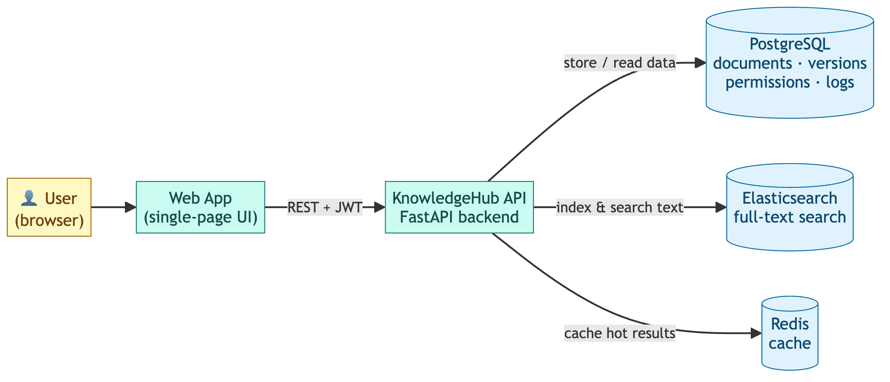

# KnowledgeHub

> Enterprise knowledge management platform — create, version, search, and collaborate on technical documents at scale (à la Confluence / Notion).

KnowledgeHub is a distributed knowledge base that lets organizations create, organize, search, and share technical documents, policies, FAQs and project documentation across teams — with full-text search, document versioning, real-time-friendly collaboration, and secure per-document access control.

> **Repository:** https://github.com/Pranavk1105/knowledgehub

---

## Project Overview

| Capability | How it's delivered |
|---|---|
| **Web UI** | Single-page app (login, create, search, view, version history, comments) served by the API at `/app`. |
| **Document management** | Create / read / update / delete articles, organised into team *spaces*, with tags. |
| **Versioning** | Every content change writes an immutable `DocumentVersion` — full revision history. |
| **Full-text search** | Elasticsearch index with TF-IDF/BM25 ranking; pure-Python inverted index as an offline fallback. |
| **Access control** | JWT auth + global roles (admin/editor/viewer) **and** per-document ACLs (owner/editor/viewer). |
| **Collaboration** | Comments and an append-only activity/audit feed per document. |
| **Caching** | Redis caches hot reads and permission-scoped search results; in-memory fallback. |
| **Resilience** | Postgres is the source of truth; search/cache degrade gracefully if a service is down. |

The system is built with **FastAPI + SQLAlchemy + PostgreSQL + Elasticsearch + Redis**, packaged with **Docker Compose**, and is designed to scale horizontally behind a load balancer.

> **Runs anywhere:** if Postgres / Elasticsearch / Redis aren't available, the app automatically falls back to **SQLite + an in-memory cache + a pure-Python search index** — so you can run and grade it with zero infrastructure.

---

## Architecture



See [`docs/architecture.md`](docs/architecture.md) and [`docs/diagrams/`](docs/diagrams/) for the full diagram set (simple, detailed component, write-path, search-path, ER). High-level flow:

```
Browser → Web App (/app) → KnowledgeHub API (stateless, N replicas)
                             |  Auth · Documents · Search · Collaboration · Indexing
                             |
           PostgreSQL (truth) · Elasticsearch (search) · Redis (cache) · S3 (blobs)
```

---

## Project structure

```
knowledgehub/
├── app/
│   ├── main.py                # FastAPI app + routes wiring + /health
│   ├── config.py              # env-driven settings (with SQLite/in-mem fallbacks)
│   ├── database.py            # SQLAlchemy engine/session
│   ├── models.py              # ORM schema (Q4: documents, versions, ACLs, logs)
│   ├── schemas.py             # Pydantic request/response models
│   ├── auth.py                # bcrypt + JWT + authorization helpers
│   ├── cache.py               # Redis cache w/ in-memory fallback
│   ├── search.py              # Elasticsearch engine w/ inverted-index fallback
│   ├── routers/               # auth, documents, search, collaboration endpoints
│   ├── static/index.html      # single-page Web UI (served at /app)
│   └── services/
│       ├── inverted_index.py  # Q5: TF-IDF + cosine keyword search (stdlib only)
│       └── document_service.py# versioning + index sync + cache invalidation
├── notebooks/demo.ipynb       # executable demo of the algorithm + full API
├── docs/
│   ├── architecture.md        # Mermaid diagrams (+ ASCII fallback)
│   ├── diagrams/              # rendered architecture + ER + sequence PNGs (and .mmd sources)
│   └── screenshots/          # live Swagger UI / health / end-to-end run captures
├── scripts/
│   ├── demo_transcript.py     # reproducible end-to-end run against the stack
│   └── build_pdf.py           # builds KnowledgeHub_Documentation.pdf
├── smoke_test.py              # end-to-end test (no external services needed)
├── docker-compose.yml         # Postgres + Elasticsearch + Redis + API
├── Dockerfile
├── requirements.txt
├── .env.example
├── DOCUMENTATION.md           # consolidated project report (source for the PDF)
├── EXPLANATION_GUIDE.md       # plain-language walkthrough (architecture, viva Q&A)
├── CODE_WALKTHROUGH.md        # line-by-line explanation of every file + imports
├── KnowledgeHub_Documentation.pdf        # the single consolidated deliverable PDF
├── KnowledgeHub_Explanation_Guide.pdf    # companion explanation/presentation PDF
└── KnowledgeHub_Code_Walkthrough.pdf     # line-by-line code reference PDF
```

---

## Dependencies

- **Python 3.11 or 3.12** (3.14 wheels for some deps may not yet exist — use 3.12)
- FastAPI, Uvicorn, SQLAlchemy, Pydantic, python-jose, bcrypt
- Elasticsearch + Redis Python clients (optional at runtime — fallbacks exist)
- Docker & Docker Compose (only for the full multi-service stack)

Full pinned list in [`requirements.txt`](requirements.txt).

---

## Setup Instructions

### Option A — Zero-infrastructure (fastest, great for grading)

```bash
cd knowledgehub
python3.12 -m venv .venv
source .venv/bin/activate            # Windows: .venv\Scripts\activate
pip install -r requirements.txt
```

Run the end-to-end test (uses SQLite + in-memory fallbacks):

```bash
python smoke_test.py
```

Start the API:

```bash
uvicorn app.main:app --reload
```

Then open:
- **Web app:** http://localhost:8000/app
- **Interactive API docs (Swagger):** http://localhost:8000/docs
- **Backend status:** http://localhost:8000/health

### Option B — Full distributed stack (Docker Compose)

```bash
cp .env.example .env                 # adjust secrets if you like
docker compose up --build
```

This starts PostgreSQL, Elasticsearch, Redis and the API together. The API waits for the data services to be healthy, then serves the **web app at http://localhost:8001/app** (Swagger at `/docs`).

> **Host ports (compose):** to avoid clashing with other local services, the stack publishes on non-default host ports — API `8001`, Postgres `5433`, Elasticsearch `9201`, Redis `6380`. Container-internal ports are unchanged, so the services still talk to each other on `5432/9200/6379` over the Docker network. With the stack up, `GET http://localhost:8001/health` reports `"search_backend": "elasticsearch"` and `"cache_backend": "Redis"`. Swap `8000` → `8001` in the curl examples below when using Docker.

---

## Execution Steps (typical demo)

1. **Register & log in**

   ```bash
   curl -X POST localhost:8000/auth/register \
     -H 'Content-Type: application/json' \
     -d '{"email":"alice@corp.com","full_name":"Alice","password":"secret1","role":"editor"}'

   TOKEN=$(curl -s -X POST localhost:8000/auth/login \
     -d 'username=alice@corp.com&password=secret1' | python -c 'import sys,json;print(json.load(sys.stdin)["access_token"])')
   ```

2. **Create a document**

   ```bash
   curl -X POST localhost:8000/documents -H "Authorization: Bearer $TOKEN" \
     -H 'Content-Type: application/json' \
     -d '{"title":"Deployment Guide","content":"How to deploy to production Kubernetes.","tags":["devops"]}'
   ```

3. **Search** — `GET /search?q=production%20kubernetes`
4. **View versions** — `GET /documents/{id}/versions`
5. **Share** — `POST /documents/{id}/share` with `{"user_id": "...", "level": "viewer"}`
6. **Comment / activity** — `POST /documents/{id}/comments`, `GET /documents/{id}/activity`

Or just open [`notebooks/demo.ipynb`](notebooks/demo.ipynb), which walks through the indexing algorithm and then the full API.

---

## Key API endpoints

| Method | Path | Description |
|---|---|---|
| `POST` | `/auth/register` | Create an account |
| `POST` | `/auth/login` | Obtain a JWT (OAuth2 password flow) |
| `GET`  | `/auth/me` | Current user |
| `POST` | `/documents` | Create a document |
| `GET` / `PUT` / `DELETE` | `/documents/{id}` | Read / update (new version) / delete |
| `GET`  | `/documents/{id}/versions` | Revision history |
| `POST` | `/documents/{id}/share` | Grant per-document access |
| `GET`  | `/search?q=...` | Permission-filtered, cached full-text search |
| `POST` / `GET` | `/documents/{id}/comments` | Collaboration |
| `GET`  | `/documents/{id}/activity` | Audit / activity feed |
| `GET`  | `/health` | Liveness + active backends |

---

## Additional Project Details

- **Indexing algorithm (Q5):** `app/services/inverted_index.py` implements tokenization, an inverted postings map, TF-IDF weighting and cosine-similarity ranking using only the standard library — the same principles Lucene/Elasticsearch build on.
- **Why fallbacks:** the search and cache layers detect missing services at startup and degrade gracefully, so the project is runnable for evaluation without provisioning a cluster while still being production-shaped.
- **Source of truth:** PostgreSQL holds documents, versions, permissions and logs; Elasticsearch is a derived index that can be rebuilt from Postgres at any time.
- **Documentation:** the consolidated report is committed as [`KnowledgeHub_Documentation.pdf`](KnowledgeHub_Documentation.pdf); its source is [`DOCUMENTATION.md`](DOCUMENTATION.md).

### Regenerate the documentation PDF

The committed PDF is built from `DOCUMENTATION.md` (Markdown → HTML → PDF via headless Chrome):

```bash
.venv/bin/pip install markdown pygments     # one-time
python scripts/build_pdf.py                 # writes KnowledgeHub_Documentation.pdf
```

To re-render the architecture diagrams from their Mermaid sources in `docs/diagrams/*.mmd`:

```bash
npx -y @mermaid-js/mermaid-cli -i docs/diagrams/01_architecture.mmd -o docs/diagrams/01_architecture.png -s 2
```

---

## License

Created for academic submission (System Design, Semester 4).
