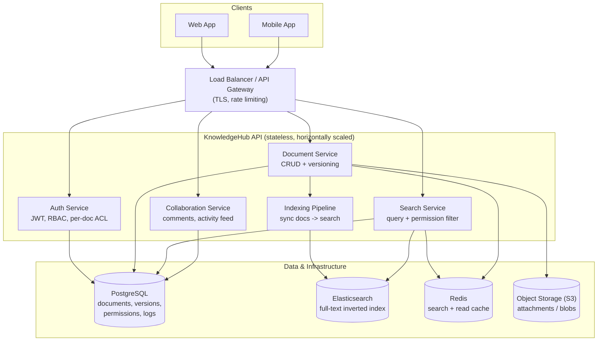
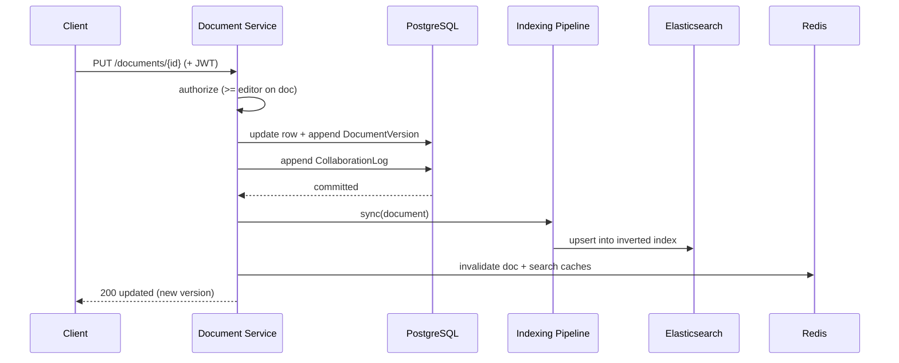
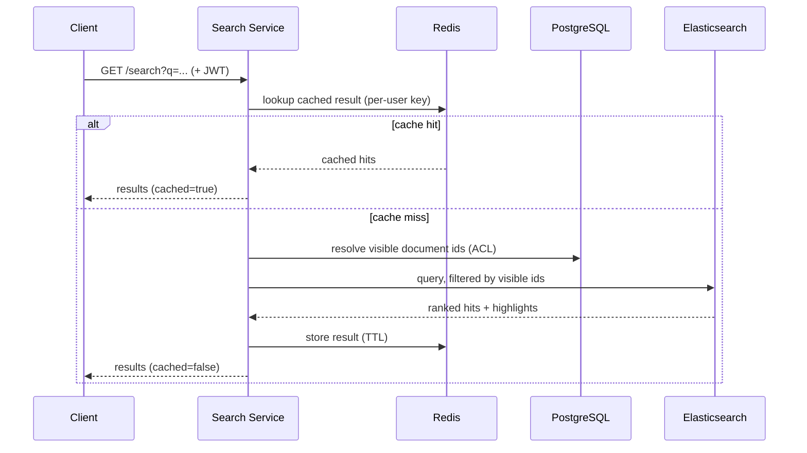

# KnowledgeHub — System Architecture

## High-level component diagram



## Write path (create / update a document)



## Read / search path



## ASCII fallback (if Mermaid does not render)

```
         Web / Mobile clients
                  |
        Load Balancer / Gateway
                  |
   ----------------------------------------
   |        KnowledgeHub API (N pods)      |
   |  Auth | Documents | Search | Collab   |
   |          + Indexing Pipeline          |
   ----------------------------------------
       |          |          |        |
   PostgreSQL  Elasticsearch Redis  Object
   (source of  (full-text   (cache) Storage
    truth)      index)              (blobs)
```
